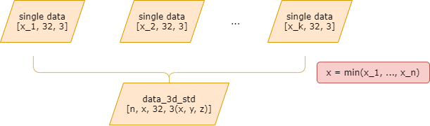
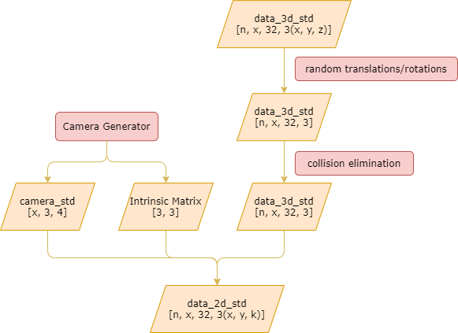

# Documentation

* [Documentation](#documentation)
   * [Prepare Dataset](#prepare-dataset)
      * [Principles](#principles)
      * [Execution](#execution)
   * [Data Enhancement](#data-enhancement)
      * [Principles](#principles-1)
         * [Random Functioning](#random-functioning)
         * [Collision Elimination](#collision-elimination)
         * [Camera generator](#camera-generator)
      * [Execution/Super-parameters](#executionsuper-parameters)
   * [Video Pose 3D Estimation](#video-pose-3d-estimation)
      * [Principles](#principles-2)
      * [Algorithm for Single-view Camera Coordination Regression](#algorithm-for-single-view-camera-coordination-regression)
      * [A Multi-view Matching Loss Algorithm](#a-multi-view-matching-loss-algorithm)
      * [Execution/Super-parameters](#executionsuper-parameters-1)
   * [STAR Visualization](#star-visualization)
      * [Principles](#principles-3)
      * [Execution](#execution-1)

The following part of this file defines all the used classes/functions in each block. Again, please turn back to [README.md](./README.md) if you have not understood the macro functionalities of all the workflow parts.

## Prepare Dataset

### Principles

You can find the file [prepare_dataset.py](./DataGenerators/prepare_dataset.py) in the dir `DataGenerators`. This part simply combine `n` data files into one into the dir `DataGenerators/data`. With the generated combined dataset we’re able to improve the effeciency of IO for the machine whether it’s on Windows, Mac or Linux - for over 50% speed-up. The possible explanation of this part is that, the newly formed `data_3d_h36m.npz` is stored in the working environment (instead of the disk) and is much easier to retrieve by the machine.

By graph presentation, the algorithm of the data preparation part can be expressed as below.



### Execution

For execution, please firstly download the datasets from [Human3.6M Official Website](http://vision.imar.ro/human3.6m/description.php) into `DataGenerators/data/h36m`, so that the python script can successfully load your dataset. Make sure your dir tree look like this:

```shell
./data/h36m
|-- S1_Directions\ 1.mat
|-- S1_Directions.mat
|-- S1_Discussion\ 1.mat
|-- S1_Discussion.mat
|-- S1_Eating\ 2.mat
```

After you’ve completed the structure for the input, simply type

```shell
cd ./DataGenerators/
python3 prepare_dataset.py
```

After this step, you’ll get a combined data in `DataGenerators/data/data_3d_h36m.npz`

## Data Enhancement

### Principles

This part is core of this project, and will be explained detailedly. The overall algorithm of this part can be expressed as a self-developed algorithm, as shown below.


Each part of the algorithm is separated from each other and is implemented individually.

-   Random Functioning. The random functioning part comprises of the random translation part and the random rotation part. Both parts take one person and do ramdom switches on the person, after which multiple persons will be combined and put into one coordinate system and form a new series of data. The dataset is thus “enhanced” to a new one, with multiple persons and a double/triple complexity.
-   Collision Elimination. This part deals with the collision after the random functioning part. After the random functioning part the persons are likely to collide with each other, which is forbidden in real datasets. Our group thus provides a self-developed algorithm to the dataset to gain a *shift vector* for each person to avoid collisions.
-   Camera Generation. After the collision elimination part we now gain the 3 dimensional dataset with multiple persons in each frame. Now by the extrinsic camera matrix we gain the corresponding 2 dimensional dataset, and by the intrinsic camera matrix we gain the corresponding 2 dimensional dataset without deleterious distortions. This part also simulates different kinds of motions of cameras, e.g. phone camera and surveillance camera.

By graph presentation, the algorithm of data enhancement part can be expressed as below.



Now we look into each part one by one.

#### Random Functioning

This part basically deals with the movements of the raw data. Firstly, the algorithm randomly shifts the timeline of the input data pieces; secondly, the algorithm randomly translationally moves the persons; at last, if the user passes in a command for rotation, execute the rotation part. The pseudo-code is shown below.


#### Collision Elimination

The collision elimination part is a brand new, self-developed algorithm, *Sequential Approach for Eliminating Individual Collisions* (SAEIC) Algorithm.  The Pseudo-code is shown below.


In this function, there is another complicated function `find_shift_vector()`, which is illustrated below.


#### Camera generator

This part basically transfers the 3D data into 2D data by using the extrinsic and intrinsic camera matrices. Firstly we apply the extrinsic camera matrix to obtain the 2D data in the camera lens, then we apply the intrinsic camera matrix to obtain the real pixels on the imager or screen. The knowledge about extrinsic/intrinsic can be obtained on [CSDN](https://blog.csdn.net/liulina603/article/details/52953414) or [my blog](http://jackgetup.com/2021/06/26/datasetexpansion/reporton27june-md/).

This part can also be used to apply different types of camera movements, like phone movements and surveillance camera movements. 

### Execution/Super-parameters

For execution simply type

```shell
cd ./DataGenerators/
python3 run.py
```

If you’re on the right way, you will find `data_multi_3d_h36m.npz` in dir `data` (which is the same-level dir of DataGenerators).

If you want to changes the super-parameters, you have these choices below:

| Arg.   | Abbr.           | Meaning                                                      | Default   |
| ------ | --------------- | ------------------------------------------------------------ | --------- |
| `-d`   | `--dataset`     | The dataset to be expanded.                                  | *h36m*    |
| `-min` | `--min`         | The minimum number of persons in the new dataset.            | 2         |
| `-max` | `--max`         | The maximum number of persons in the new dataset             | 4         |
| `-s`   | `--shift`       | The mean value for shifting the timeline.                    | 500       |
| `-t`   | `--translation` | The mean value for the random translation part.              | 1000      |
| `-r`   | `--rotation`    | Whether rotating a single raw data (*True*) or not (*False*). | *True*    |
| `-n`   | `--number`      | The number of the generated datasets (all at once).          | 16        |
| `-c`   | `camera`        | The type of camera used to generate the new dataset.         | [‘Phone’] |
| `-v`   | `--view`        | The number of view sites.                                    | 1         |

If you are curious about the source code implementing the parameters, turn to [DataGenerators/arguments.py](./DataGenerators/arguments.py)

## Video Pose 3D Estimation

### Principles

Note that although this part is already implemented, it’s not reported yet because it containes much mathematical knowledge. The detailed illustration of this part will be shown in the **essay**.

This workflow part aims to switch 2D pose to 3D. The main technique used is the regressor, with a back-propagation process `back_forward()` to gain the feedback system with a loss value.

The basic logic of this part can be expressed below.


### Algorithm for Single-view Camera Coordination Regression


### A Multi-view Matching Loss Algorithm


We use the regression test to estimate the loss of the trajectories and poses of each subject, and use the results to analyze the performance of our dataset.

### Execution/Super-parameters

Before you star this part, please make sure that you already have `data/data_multi_h36m.npz` in your project directory.

Firstly, we need to run the baseline for comparison.

```shell
cd VideoPose3D
python3 baseline.py
```

Secondly, we need to run the fine-tune script to carry out the better arguments. Then, we run the new arguments.

```shell
python3 fine-tune.py
python3 run.py
```

At last, if you want to figure out the graphical results, please use the visualization approach provided.

```shell
python3	visualization.py 
```

| Arg.    | Abbr.                      | Meaning                                                      | Default                   |
| ------- | -------------------------- | ------------------------------------------------------------ | ------------------------- |
| `-d`    | `--dataset`                | The dataset to be expanded.                                  | *h36m*                    |
| `-k`    | `--keypoints_number`       | The number of key points in each frame.                      | 17                        |
| `-c`    | `--checkpoint`             | The dir for outputting checkpoints.                          | `checkpoint`              |
| `-l`    | `--load`                   | The checkpoint file to be loaded.                            | `pretrained_h36m_cpn.bin` |
| /       | `--save`                   | The checkpoint file to be saved.                             | `trained_h36m_cpn.bin`    |
| `-v`    | `--multi-view`             | Whether the data set has multi-view (*True*) or not (*False*). | *False*                   |
| `-eval` | `--evaluate`               | Whether the machine makes evaluation after getting the 3D ground truth (*True*) or not. (*False*) | *True*                    |
| `-u`    | `--update`                 | Whether the machine updates the parameters of the model (*True*) or not (*False*). | *True*                    |
| `-o`    | `--output`                 | Whether the output predicts the 3D pose (*True*) or not(*False*). | *False*                   |
| /       | `--export-training-curves` | If flagged, save training curves (as `*.png` files)          | **FLAG HAS NO DEFAULT**   |
| `-s`    | `--stride`                 | The trunk size to use when training.                         | 1                         |
| `-e`    | `--epochs`                 | The number of training epochs.                               | 4                         |
| `-drop` | `--dropout`                | The probability for dropouts.                                | 0.25                      |
| `-lrd`  | `--lr-decay`               | The decay of learning rate through each epoch.               | 0.95                      |
| `-arc`  | `--architecture`           | The filter widths (separated by commas).                     | 3, 3, 3, 3, 3             |
| /       | `--causal`                 | If flagged, use causal convolutions for real-time processing. | **FLAG HAS NO DEFAULT**   |
| `-ch`   | `--channels`               | The number of channels in the convolution layers.            | 1024                      |

If you are curious about the source code implementing the parameters, turn to [VideoPose3D/common/arguments.py](VideoPose3D/common/arguments.py).

## STAR Visualization

### Principles

At the last part of our project, we use the [STAR method](https://star.is.tue.mpg.de/) to make the flat subjects more visible and instinctively looking.

### Execution

Before you run this part of file, please make sure your `visualization/model` look like this:

```shell
$ tree ./model
./model
|-- LICENSE.txt
|-- female
|   `-- model.npz
|-- male
|   `-- model.npz
`-- neutral
    `-- model.npz
```

If you want to run a demo object that has all zero vectors, simply run the command below.

```shell
cd visualization
python3 demo.py
```

If you want to carry out a better object with actions, please run the command below.

```shell
python3 run.py
```

Note that the output files are in `visualization/objects`.

