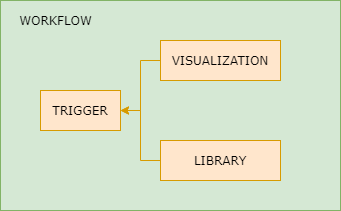
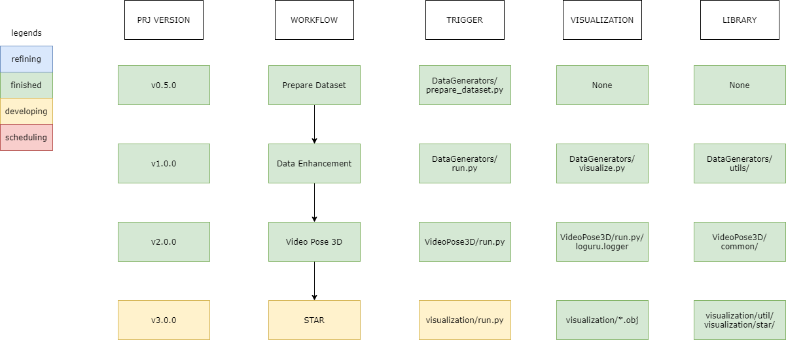

# DE-PRJ: V-2.0.0 (BREAKTHROUGH)

* [DE-PRJ: V-2.0.0 (BREAKTHROUGH)](#de-prj-v-200-breakthrough)
   * [Release Notes](#release-notes)
   * [Codeblock Level Logic](#codeblock-level-logic)
   * [Overall Layout of the Project](#overall-layout-of-the-project)
   * [Super-parameter Layout](#super-parameter-layout)

## Release Notes

Version 2.0.0 is release because we’ve completed the implementation for single-view camera coordination regression.

## Codeblock Level Logic

The codeblock level logic of this project is conposed of four blocks:

-   Workflow Block. The workflow block defines the most readable workflow of the whole project, and it is embodied by the directories of the project.
-   Trigger Block. The trigger block is the trigger Python script of **each** workflow block. In other words, each workflow block contains one and only one trigger block. For example, `run.py` is the trigger block of the workflow dir `DataGenerators`.
-   Visualization Block. The visualization block is elaborated to give a feedback the data processing. Developers are required to utilize the visualization blocks to examine whether the current workflow block is behaving malfunctionally. 
-   Library Block. The library blocks include all class/function definitions for the corresponding workflow block. This block often consists of a large amount of files, each in charge of a certain & separate library of function definitions.

By graph presentation, the codeblock level logic can be expressed as below.

## Overall Layout of the Project

The overall layout of the Project is composed of 4 workflow blocks hitherto, each behaving on a certain functionality.

-   Prepare Dataset. In this part, we transform pieces of raw data from `Human3.6M` Dataset into one Python-readable piece of data, in order to enhance the speed of input/output of the data with the machine. This step is inevitable and has been proved to improve at least 50% efficiency of the program.
-   Data Enhancement. In this part, we utilize the transfered dataset to make a new dataset with multiple persons in one frame. The basic idea is, in each frame we construct 3 persons into the same scene to enhance the dataset.
-   Video Pose 3D. This part is designed to transform the data with 2D Pose to 3D Pose. The substantive technique used in this part is regression, and we’ve designed an elaborated visualization part for this workflow block. The main model of this part is retrieved from the Github Project `VideoPose3D`.
-   STAR Model. This model is not yet elaborated and will be worked on after the release of version 2.0.0.

By graph presentation, the overall layout of the project can be expressed as below.

For dissecting all the parts please turn to [DOCUMENTATION.md](./DOCUMENTATION.md), which elaborates on the explanation of all functions and parameters passed in for each code block.

## Super-parameter Layout

The basic dataset layouts including the vertex layout of `Human3.6M` is in [DATASETS.md](./DATASETS.md), and the vertex layout of the STAR model is in [DOCUMENTATION.md](./DOCUMENTATION.md). Other super-parameters are also available in [DOCUMENTATION.md](./DOCUMENTATION.md)

If you want to change the super-parameters layout of the Data Generators workflow part, please change the `*_utils.py` files in dir `DataGenerators`. Note that you have to visualize the results after you change them, in order to prevent possible hitches in building.

